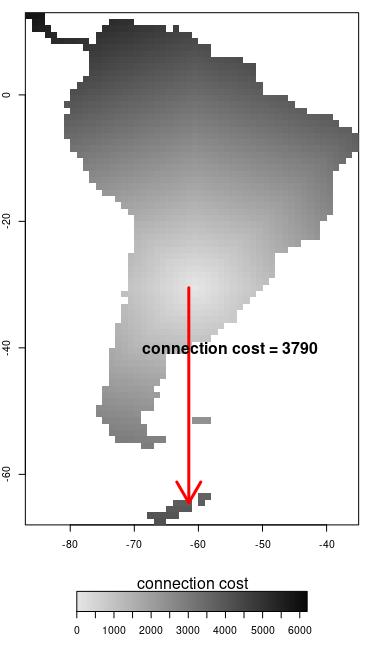
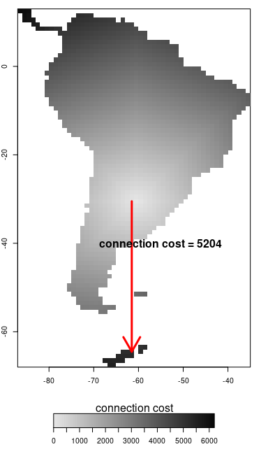

```{r, include = FALSE}
library(knitr)
knitr::opts_chunk$set(
  collapse = TRUE,
  comment = "#>", 
  tidy=T,
  fig.align='center',
  tidy.opts = list(width.cutoff=80),
  results='hold'
)
```

# Introduction

This vignette shows how to create input space objects necessary to run *gen3sis2*. These objects are:

-   a spaces.rds file containing a space list of raster stacks for environmental variables;

-   a series of rds files, one for each time-step, including distance matrices between sites.

To create these files, we use the function *create_spaces_raster* which requires as arguments:

-   a named list of environmental rasters containing layers for the different time-steps, with each raster layer representing the spatial distribution of an environmental variable;

-   a cost function defining how dispersal between particular types of sites is penalized (to be used for the calculation of the distance matrices).

Below, we will generate the R objects required by the function *create_input_space* step by step. For this exercise, we will use the space of South America that we used in the [**introduction vignette**](introduction.html) and is a small piece of the global space used at the case study of the main package manuscript[^1]. The space data as well as the input rasters are available at the [simulation repository](https://github.com/project-gen3sis/Simulations). Download these and define the correct path to it in order to continue.

[^1]: O. Hagen, B. Flück, F. Fopp, J.S. Cabral, F. Hartig, M. Pontarp, T.F. Rangel, L. Pellissier. (2020). GENƎSIS: the GENeral Engine for Eco-Evolutionary SImulationS on the origins of biodiversity. (in review)

First, load the necessary packages and set the working directory:

```{r, message=F, eval=FALSE, results='hide'}
#first we load the required packages
library(gen3sis2)
library(terra)

#next we set the working directory to the downloaded data  
datapath <- "data_from_project_gen3sis_simulations"
```

```{r, echo=FALSE, message=F, results='hide'}
#knitr::opts_knit$set(root.dir = '../inst/extdata/')
# getwd()
library(gen3sis2)
library(terra)
```

## Creating the environmental rasters bricks

Second, create the SpatRaster containing the spatio-temporal distribution of the environmental variables of interest. Here, we will use the temperature, aridity and area rasters of the 1d example of South America that has been used in the [**introduction vignette**](introduction.html). We first load the three corresponding raster bricks from the hard drive.

```{r, eval=FALSE, message=F}
setwd(datapath)
temperature_raster <- rast('input_rasters/SouthAmerica/temperature_rasters.grd')
aridity_raster <- rast('input_rasters/SouthAmerica/aridity_rasters.grd')
area_raster <- rast('input_rasters/SouthAmerica/area_rasters.grd')
```

If you want to see an example on how you can create a virtual dynamic space from scratch, please refer to the [**design_space vignette**](design_space.html).

## Creating a list with the environmental raster bricks

To create the input space for *gen3sis2*, all environmental variables have to be stored as raster files in a named list. It is important to add the name of the environmental variable you want to use in the list, which will be used when specifying the config file. Alternatively, you can also create a list which contains all of the raster file paths on your hard drive.

We will now create a list that contains all of the layers of our raster bricks for temperature, aridity and area.

```{r, eval=FALSE}
spaces_list <- list(
  temp = temperature_raster,
  arid = aridity_raster,
  area = area_raster
)
```

## Defining a cost function

Additionally, we need to define a *cost function* which defines the connection cost between sites. The species dispersal ability will determine if sites are reachable (i.e. if the dispersal event is higher than the connection cost).

First, we will look at a very simple case, where no additional cost is added to the geographical distances, meaning that connections costs equal distance in grid cell units multiplied by the raster resolution. For spaces with a coordinate system (*crs*) the cost is defined in meters, as defined by the coordinate system. By dividing the cost function by 1000 we get the cost of traveling for 1 km. We can define a simple cost function in which the dispersal is not penalized:

```{r, eval=FALSE}
cost_function_null <- function(source, dest) {
    return(1/1000) 
}
```

```{r, echo=FALSE, eval=FALSE}
spaces_list_t0 <- list(temp=NULL)
spaces_list_t0$temp <- temperature_raster[[1]]

create_input_space(
  raster_list = spaces_list_t0,
  cost_function = cost_function_null,
  output_directory = tempdir(), # a directory name to save the files in
  directions = 8, # all surrounding sites from a focus site
  full_dists = TRUE, # full distance matrix
  overwrite_output = T,
  crs = "+proj=longlat +ellps=WGS84 +datum=WGS84 +no_defs"
)

create_spaces_raster(
  raster_list = spaces_list_t0,
  cost_function = cost_function_null,
  output_directory = tempdir(), # a directory name to save the files in
  directions = 8, # all surrounding sites from a focus site
  duration = list(from = 0, to = 0, by = 0, unit = "Ma"),
  full_dists = TRUE, # full distance matrix
  overwrite_output = T,
  crs = "+proj=longlat +ellps=WGS84 +datum=WGS84 +no_defs",
  geodynamic = TRUE
)

```

```{r, eval=T, echo=FALSE, fig.width=4, fig.height=7, fig.cap='This figure shows the connection costs from one site in the middle of South America to all other sites. To travel to the site of Antarctica that is indicated with the arrow, the travelling cost is 3790. The distance matrix was computed using the very simple cost function that has been introduced before and is not adding any penalty.', fig.align='center'}


#dist_matrix_null_t0 <- readRDS(file.path(datapath, 'CostFunctionExamples/cost_function_null/distances_full/distances_full_0.rds'))
#spaces_null <- readRDS(file.path(datapath, 'CostFunctionExamples/cost_function_null/spaces.rds'))

#spaces_null <- readRDS('inst/extdata/SouthAmerica/space/spaces.rds')
#spaces_null_t0 <- na.omit(spaces_null$temp[, c('x', 'y', '0')])

#dist_null_t0_mat <- cbind(spaces_null_t0[,c('x', 'y')], cost=as.numeric(dist_matrix_null_t0[,1300]))
#dist_null_t0 <- rasterFromXYZ(dist_null_t0_mat)

#maxcost <- 6200
#mincost <- 0
#cost_breaks <- seq(mincost, maxcost, by=20)
#cost_colors <- rev(gray(seq(0.03, 0.9, length.out=length(cost_breaks)-1)))

#par(mar=c(1,2,1,2))
#layout(matrix(c(1,1,1,1,2), ncol=1))

#par(mar=c(1,1,1,2))
#image(dist_null_t0, col=cost_colors, breaks=cost_breaks)
#plot(dist_null_t0, col=cost_colors, breaks=cost_breaks, axes=F, box=F, legend.args = list(text = 'connection cost', side = 2, 
#         font = 2, line = 0.5, cex = 0.8))
#arrows(-61.5, -30.5, -61.5, -64.5, lwd=3, col='red')
#text(-55, -40, labels=paste('connection cost =', round(dist_null_t0_mat$cost[dist_null_t0_mat$x==(-61.5) & dist_null_t0_mat$y==(-64.5)], 0)), cex=1.5, font=2)

#plot.new()
#legend_df <- as.data.frame(cbind(seq(0, length(cost_breaks)-1, length.out=(length(cost_breaks))), rep(0.25, (length(cost_breaks))), cost_breaks))
#legend_image <- rasterFromXYZ(legend_df, res=0.01)
#plot(legend_image, legend.only=T, col=cost_colors, horizontal=T, smallplot=c(0.2, 0.8, 0.45, 0.6), 
#   axis.args=list(at=seq(mincost, maxcost, 500),labels=seq(mincost, maxcost, 500)), legend.args=list(text='connection cost'))
```

For a slightly more sophisticated cost function, where only sites which have environmental values (no NAs) are considered habitable and suitable terrestrial sites should have a cost penalty of one (x1), but dispersal over water sites should double (x2) the cost of dispersal.

```{r, eval=FALSE}
cost_function_water <- function(source, dest) {
  if(!all(source$habitable, dest$habitable)) {
    return(2/1000)
  } else {
    return(1/1000)
  }
}
```

```{r, echo=FALSE, eval=FALSE}
create_spaces_raster(
  raster_list = spaces_list_t0,
  cost_function = cost_function_water,
  output_directory = tempdir(), # a directory name to save the files in
  directions = 8, # all surrounding sites from a focus site
  duration = list(from = 0, to = 0, by = 0, unit = "Ma"),
  full_dists = TRUE, # full distance matrix
  overwrite_output = T,
  crs = "+proj=longlat +ellps=WGS84 +datum=WGS84 +no_defs",
  geodynamic = TRUE
)

```

```{r, eval=TRUE, echo=FALSE, fig.width=4, fig.height=7, fig.align='center', fig.cap='By using a cost function which penalises the crossing of water, the cost of travelling from our cell in the middle of South America to Antarctica increases to 5204.'}

# dist_matrix_water_t0 <- readRDS('inst/extdata/SouthAmerica/space/distances_full/cost_function_water/distances_full/distances_full_0.rds')
# # C:\VITAL LOCAL\Meus Documentos\ETH PhD\Code\R\package\Gen3sis\inst\extdata\SouthAmerica\space\distances_full\cost_function_null\distances_full
# spaces_water <- readRDS('inst/extdata/SouthAmerica/space/andscapes.rds')
# spaces_water_t0 <- na.omit(spaces_water$temp[, c('x', 'y', '0')])
# dist_water_t0_mat <- cbind(spaces_water_t0[,c('x', 'y')], cost=as.numeric(dist_matrix_water_t0[,1300]))
# dist_water_t0 <- rasterFromXYZ(dist_water_t0_mat)
# 
# maxcost <- 6200
# mincost <- 0
# cost_breaks <- seq(mincost, maxcost, by=20)
# cost_colors <- rev(gray(seq(0.03, 0.9, length.out=length(cost_breaks)-1)))
# 
# par(mar=c(1,2,1,2))
# layout(matrix(c(1,1,1,1,2), ncol=1))
# 
# #par(mar=c(1,1,1,2))
# image(dist_water_t0, col=cost_colors, breaks=cost_breaks)
# #plot(dist_water_t0, col=cost_colors, breaks=cost_breaks, axes=F, box=F, legend.args = list(text = 'connection cost', side = 2, 
# #         font = 2, line = 0.5, cex = 0.8))
# arrows(-61.5, -30.5, -61.5, -64.5, lwd=3, col='red')
# text(-55, -40, labels=paste('connection cost =', round(dist_water_t0_mat$cost[dist_water_t0_mat$x==(-61.5) & dist_water_t0_mat$y==(-64.5)], 0)), cex=1.5, font=2)
# 
# plot.new()
# legend_df <- as.data.frame(cbind(seq(0, length(cost_breaks)-1, length.out=(length(cost_breaks))), rep(0.25, (length(cost_breaks))), cost_breaks))
# legend_image <- rasterFromXYZ(legend_df, res=0.01)
# plot(legend_image, legend.only=T, col=cost_colors, horizontal=T, smallplot=c(0.2, 0.8, 0.45, 0.6), 
#    axis.args=list(at=seq(mincost, maxcost, 500),labels=seq(mincost, maxcost, 500)), legend.args=list(text='connection cost'))
```

Whether a specific site can be reached or not depends on the properties of the population or species.

## Further useful arguments

Besides the (i) space list, (ii) cost function and (iii) experiment folder, we can define further arguments such as: directions, time-steps and calculate_full_distance_matrices.

The argument 'directions' requires an integer providing the amount of directions used to calculate distances. It can take 4, 8 or 16 as values to consider the four, eighth or 16 neighboring sites.

The argument 'duration' requires a named list with information about the start ("from"), end ("to"), step size ("by") and time unit ("unit") of the enviromental series.  Is also used to name the files and to name the timesteps in the *spaces.rds* space object created by the *create_spaces_raster* function. 

The argument 'full_dists' defines whether the *create_spaces_raster* function will create one large distance matrix for all suitable sites (calculate_full_distance_matrices=TRUE) or a list of small distance matrices for the neighboring sites specified in 'directions' around each suitable site (full_dists=FALSE). The full distance matrix confers faster computing speed for the model, but requires a larger storage. The local distance matrices cause a slower computing speed, but require smaller storage. The slower speed emerges form the fact that a full distance matrix is then reconstructed by concatenating local distances matrices each time-step during a simulation run.

The real geographic coordinate system can be provided which allows for the global spherical distance correction. The reference system can be set by using the 'crs' argument of the *create_spaces_raster* function. Here we are using the world geodetic system (WGS84) but providing a projected coordinate reference system is also possible. If you want to ensure that all cells have the same area you might consider an equal-area projection, such as the Lambert azimuthal equal-area projection. For real spaces with valid coordinate systems (e.g. *crs="+proj=longlat +datum=WGS84"*), the distance unit is in meters (m). If you would use hypothetical spaces, such as in the [**design_space vignette**](design_space.html), geographic distance would be measured in units of sites multiplied by the grid cell resolution.

## Create input files

The *create_spaces_raster* function creates *.rds* files that will be used as input for *gen3sis2*. The file path where the spaces and the distance matrices of all time steps should be stored can be specified within the function.

```{r, eval=FALSE}
create_spaces_raster(
  raster_list = spaces_list,
  cost_function = cost_function_water,
  directions = 8,
  output_directory = file.path(tempdir(), "SouthAmerica"),
  duration = list(from = 65, to = 0, by = -1, unit = "Ma"),
  crs = "+proj=longlat +ellps=WGS84 +datum=WGS84 +no_defs"
)
```

Finally, do not forget to specify the space metadata you just created. We recommend storing it in form of a METADATA.txt file within the space folder. A template is automatically created by the functions *create_input_space* at the correct location. Once the input space is ready, the *run_simulation* function can start the simulation using the path of the new space.
