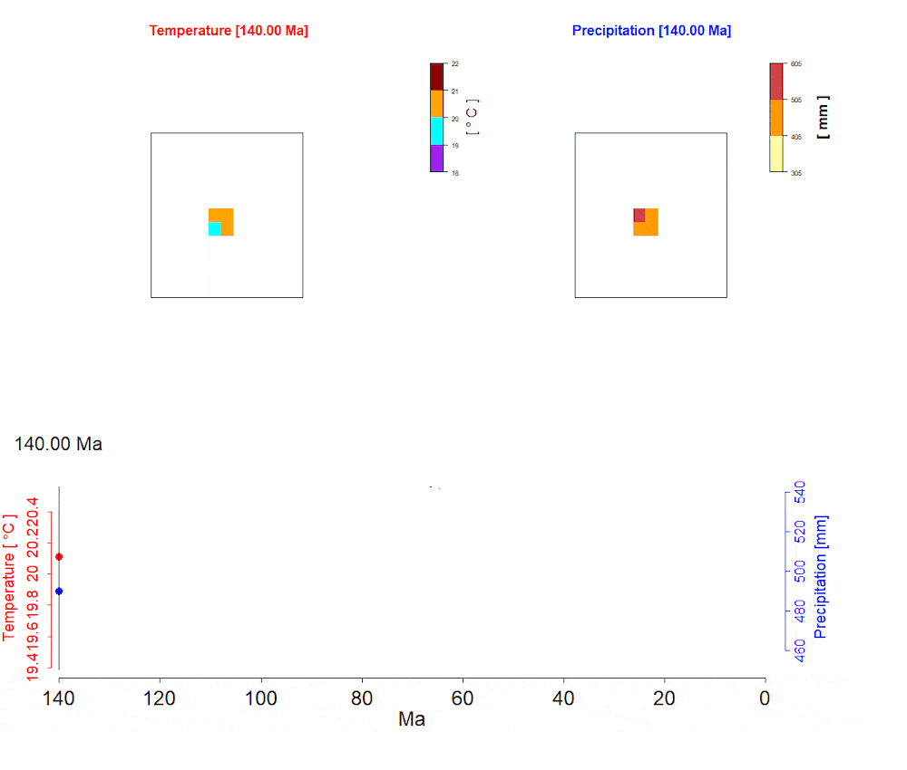

```{r include = FALSE}
knitr::opts_chunk$set(
  collapse = TRUE,
  comment = "#>",
  fig.width=7,
  tidy=T,
  fig.align='center',
  tidy.opts = list(width.cutoff=80)
)
```

To create your own landscape, you can start from anywhere. For this exercise we will create, from scratch, a simple island landscape that we used in the case study of the package manuscript[^1].


## Create your landscape grid

In this example we want to explores biodiversity dynamics and trait evolution on dynamic oceanic islands. It follows the general dynamic model of island biogeography [^2], the island we create entails the number of sites and environmental dynamics.

First, we will define the spatial extent of our landscape, i.e. the number of sites. In our case, this will be 31 by 31 sites laid in a grid cells. Next, we define the temporal dimension i.e. our landscape evolves in 140 time steps (later we interpret 1 time-step = 1 Myr).

```{r eval=FALSE}
Ncol<-31
Nrow<-31
Ntimesteps<-140
```

The next step will be to create two arrays, one for each environmental variable (i.e. temperature and precipitation). These two initially empty arrays are 3 dimensional (2 spatial and 1 temporal dimension). Later we will save the environmental variable values for the landscape file.

```{r eval=FALSE}
#Create the temperature array and matrix:
temp_array<-array(NA,dim=c(Nrow,Ncol,Ntimesteps))
temp_dataframe<-matrix(NA,nrow=Nrow*Ncol, ncol=length(c(Ncol,Nrow))+Ntimesteps)

#Create the precipitation array and matrix:
prec_array<-array(NA,dim=c(Nrow,Ncol,Ntimesteps))
prec_dataframe<-matrix(NA,nrow=Nrow*Ncol, ncol=length(c(Ncol,Nrow))+Ntimesteps)

#Creating a vector for the names to be used to name input files (one per time step) 
stringtimestepsnames<-vector(mode="character",length=Ntimesteps)
```


## Add environmental characteristics
Now that our template arrays and matrices are prepared, we can start to fill them with environmental values. We will use three nested loops to do so. The first loop iterates over the 140 time-steps, while the two inner ones iterate over all sites. To do so, we must create the environmental values which will be saved in the corresponding landscape arrays and therefore generate a heterogeneous and temporally dynamic landscape.

Our conceptual island has it's number of sites and environmental values changing over time, as shown in animation A1. The island is initiated with four sites (at 140 Ma), but the island surface progressively increases to its maximum of 81 sites (at 90 Ma due to volcanic activity) and then shrinks back to four sites at the present time (due to erosion) at double the speed of orogeny. For each time-step a temperature and precipitation layer are created following a normal distribution.


```{r tidy=T, out.width='100%', echo=F, fig.cap='A1: Animation of the conceptual island that we will create as an input landscape for gen3sis.', fig.margin=T}

```


For both temperature and precipitation uniform distribution of values over space is created. We then add environmental white noise to introduce spatial and temporal heterogeneity. For the temperature layer this will be an average of 20°C with a standard deviation of 0.5°C. For precipitation we settle for an average value of 500 mm/year with a standard deviation of 50 mm/year.

Note that we only have to assign these environmental values to the sites where we have land mass (see animation above). Within the loops we therefore check if, at the current time, we are indeed on a terrestrial site. If so, we assign a temperature and precipitation value. 


Finally, we create one dataframe to store the temperature values for all time-steps and a second dataframe for the precipitation values. These dataframes contain all possible x- and y-coordinates of our sample world as the first two columns. After the temperature and precipitation values have been created for one specific time-step, we store these values within a new column for each time step in these new dataframes.

<!--
At the end of each time step we will calculate the distance from each habitable site to all others and store the results in form of a matrix. We will then save the distance matrix for each time step on our hard drive. 
-->

```{r eval=FALSE}
for (timestep in 1:Ntimesteps){ # temporal loop
  counting<-1
  stringtimestepsnames[timestep]<-paste("X",timestep,"", sep="")
  for (y in 1:Nrow){ #loop over the first spatial dimension
    for (x in 1:Ncol){ #loop over the second spatial dimension
      if((timestep<=10)||(timestep>120 && timestep<=140)){#time steps with only four (2x2) suitable sites
        if((y>=15 && y<=16)&&(x>=15 && x<=16)) {  #suitable sites
          temp_array[x,y,timestep] <- rnorm(1,20,0.5) #temperature
          prec_array[x,y,timestep] <- rnorm(1,500,50) #precipitation
        }
      }
      if((timestep>10 && timestep<=20)||(timestep>100 && timestep<=120)){#time steps with nine (3x3) suitable sites
        if((y>=15 && y<=17)&&(x>=15 && x<=17)) {
          temp_array[x,y,timestep] <- rnorm(1,20,0.5) 
          prec_array[x,y,timestep] <- rnorm(1,500,50)
        }
      }
      if((timestep>20 && timestep<=30)||(timestep>80 && timestep<=100)){#time steps with 25 (5x5) suitable sites
        if((y>=14 && y<=18)&&(x>=14 && x<=18)) {
          temp_array[x,y,timestep] <- rnorm(1,20,0.5) 
          prec_array[x,y,timestep] <- rnorm(1,500,50) 
        }
      }
      if((timestep>30 && timestep<=40)||(timestep>60 && timestep<=80)){#time steps with 49 (7x7) suitable sites
        if((y>=13 && y<=19)&&(x>=13 && x<=19)) {
          temp_array[x,y,timestep] <- rnorm(1,20,0.5)
          prec_array[x,y,timestep] <- rnorm(1,500,50)
        }
      }
      if(timestep>40 && timestep<=60){#time steps with 81 (9x9) suitable sites
        if((y>=12 && y<=20)&&(x>=12 && x<=20)) {
          temp_array[x,y,timestep] <- rnorm(1,20,0.5)
          prec_array[x,y,timestep] <- rnorm(1,500,50)  
        }
      }
      #Saving the environmental variables in a dataframe format for distance matrices
      if(timestep==1){
        temp_dataframe[counting,1]<-x
        temp_dataframe[counting,2]<-y
        prec_dataframe[counting,1]<-x
        prec_dataframe[counting,2]<-y
      }
      temp_dataframe[counting,2+timestep]<-temp_dataframe[x,y,timestep]
      prec_dataframe[counting,2+timestep]<-prec_dataframe[x,y,timestep]
      counting<-counting+1
    }
  }
}
```


The *create_input_landscape()* function of the *gen3sis* package takes temperature and precipitation values as a list raster layers or raster layer file names. Based on the dataframes we just created, we can now create temperature and precipitation rasters for each time-step. We then store them in a named list and save to the hard drive.


```{r eval=FALSE}
library(raster)
landscapes_list <- list()
for (timestep in 1:Ntimesteps){ 
  temp_raster <- rasterFromXYZ(temp_dataframe[, c(1,2, timestep+2)])
  prec_raster <- rasterFromXYZ(prec_dataframe[, c(1,2, timestep+2)])
  
  landscapes_list$temp <- c(landscapes_list$temp, temp_raster)
  landscapes_list$prec <- c(landscapes_list$prec, prec_raster)
}

##saving the list of rasters into .rds format to be used as input
saveRDS(landscapes_list, "inputfolder/my_experiment/landscapes.rds")
```


## Add a cost function
The connection cost between sites is defined as the distance between these sites modified by an optional cost function. This user defined cost function can give a penalty (or benefit) for crossing certain cells and will be stored as a distance matrix. For this virtual landscape, we will add a simple cost function (i.e. equal value of 1 to all sites), meaning that the connection costs are only the distance between the sites inside our grid cells. If you want to learn how to make a cost function, refer to the [**create_input_landscape vignette**](create_input_landscape.html).


[^1]: O. Hagen, B. Flück, F. Fopp, J.S. Cabral, F. Hartig, M. Pontarp, T.F. Rangel, L. Pellissier. (2020). GENƎSIS: the GENeral Engine for Eco-Evolutionary SImulationS on the origins of biodiversity. (in review)
[^2]: R.J. Whittaker, K.A. Triantis, R.J. Ladle. (2008). A general dynamic theory of oceanic island biogeography. Journal of Biogeography, 35: 977-994. \doi{10.1111/j.1365-2699.2008.01892.x}.


<!--
The distance matrix for each time step between either: (i) full distance, containing all habitable cells in the landscape (faster computing speed, larger storage required), or (ii) local distance, containing a list of distance matrices of each cell with its 16 neighbors (slower computing speed, smaller storage required). Local distances matrix are built at each timestep with equal dimension to the full distances during a simulation run.The real geographic coordinate system can be provided which allows for the global spherical distance correction. For real landscapes, the distance unit is in meters (m). In the case of hypothetical landscapes, geographic distance is measured in units of sites. The model uses serialized R files (rds) format for all inputs. The functions for processing the input data in the required format are available in the package. The package offers two options to create distance matrices: one can either compute a (i) full distance matrix at each time step, or compute a (ii) local distance matrix of all cells containing the distances between neighbouring cells. The former option will lead to faster simulations, while the latter uses less storage space. Once the data is processed, the simulation can be started with the function ‘run_simulation’.’ 

-->
